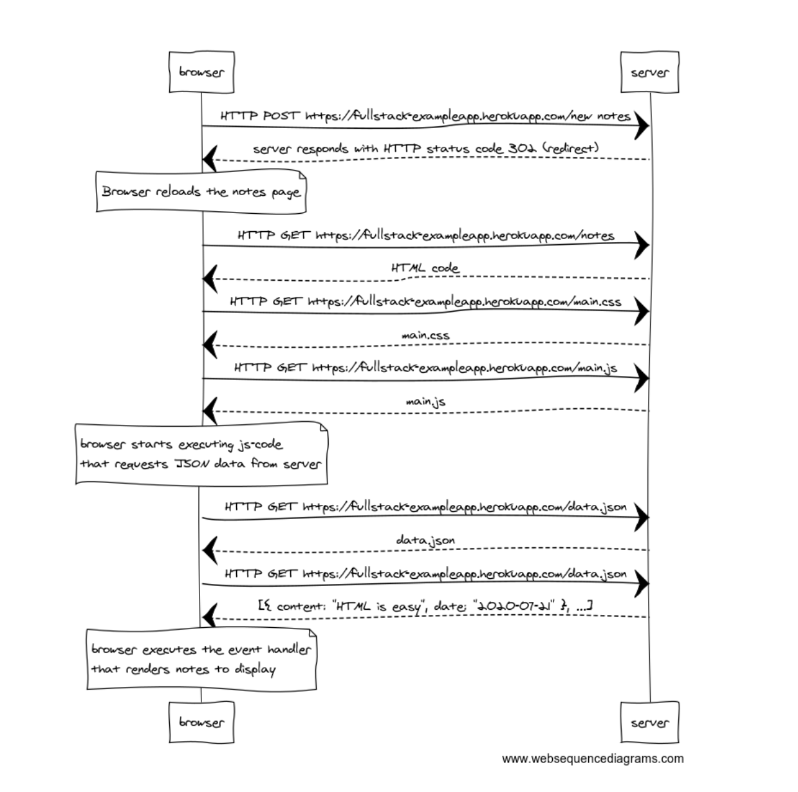
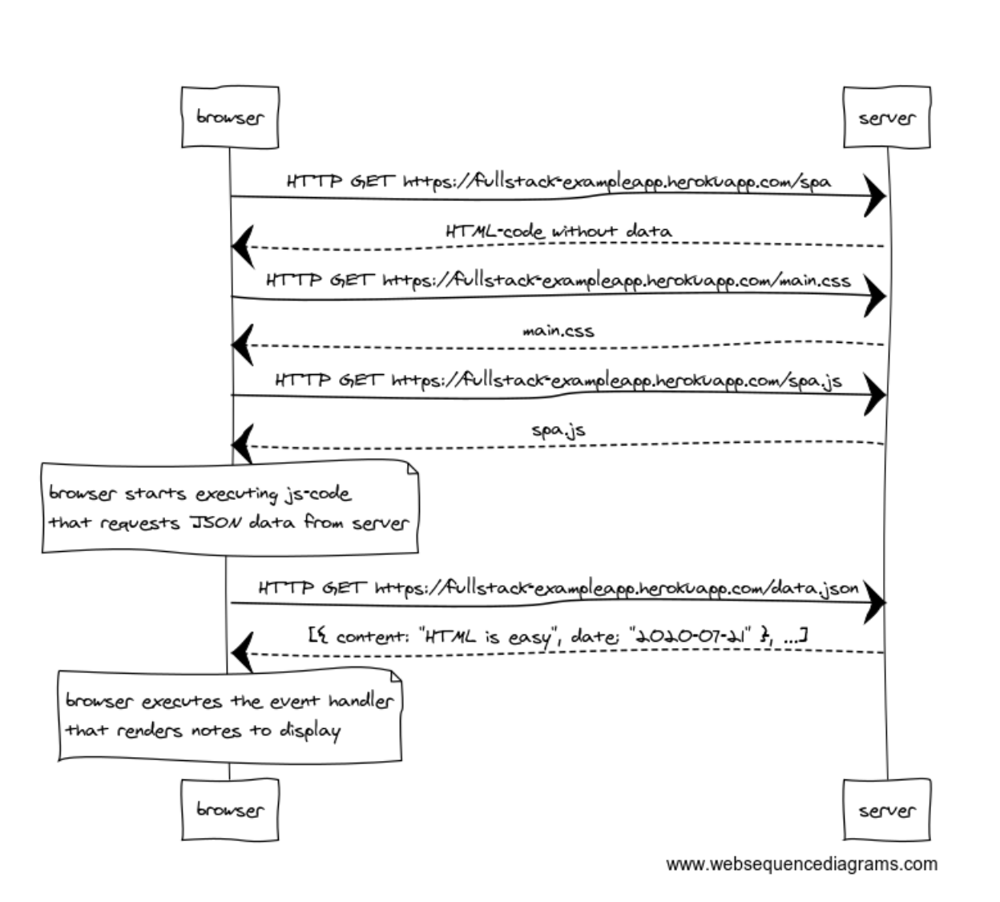
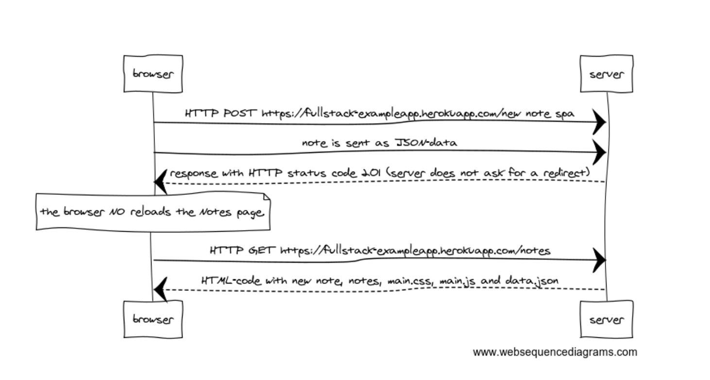

# [Fundamentals of Web apps](https://fullstackopen.com/en/part0/fundamentals_of_web_apps)

## 0.1: HTML

Review the basics of HTML by reading this tutorial from Mozilla: [HTML tutorial](https://developer.mozilla.org/en-US/docs/Learn/Getting_started_with_the_web/HTML_basics)

## 0.2: CSS

Review the basics of CSS by reading this tutorial from Mozilla: [CSS tutorial](https://developer.mozilla.org/en-US/docs/Learn/Getting_started_with_the_web/CSS_basics)

## 0.3: HTML forms

Learn about the basics of HTML forms by reading Mozilla's tutorial: [Your first form](https://developer.mozilla.org/en-US/docs/Learn/Forms/Your_first_form)

## 0.4: new note

Create a diagram depicting the situation where the user creates a new note on page https://fullstack-exampleapp.herokuapp.com/notes by writing something into the text field and clicking the submit button.

### Solution

## 0.5: Single page app

Create a diagram depicting the situation where the user goes to the single page app version of the notes app at https://fullstack-exampleapp.herokuapp.com/spa.

### Solution

## 0.6: New note on Single page app

Create a diagram depicting the situation where user creates a new note using the single page version of the app.

### Solution

